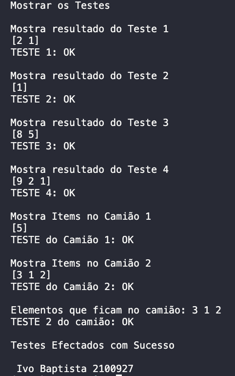

<h1 align="center">
    
</h1>

Trabalho em Ocaml

Funcionamento de uma Pila LIFO(Last In First Out) 
    
Programa em linguagem Ocaml , de nome efolioA.ml, que permita efetuar varios testes.
O programa recebe valores inteiros, e permite empilar e desempilar e mostra os valores na ordem que vão ficando:

📌 Programa sobre # Pila
Funcionamento de uma Pila LIFO(Last In First Out)
Instalamos o Ocaml seguindo a documentação e ficamos com a versão:

The OCaml toplevel, version 4.14.0

------------------

## Sintaxe para compilar:

<pre>ocamlc str.cma -o efolioA efolioA.ml
cria os ficheiros .cmi e .cmo

A ocamlopt efolioA.ml -o efolioA
cria o binario executavel e os ficheiros .o e .cmx  </pre>

## Sintaxe para executar:
<pre>./efolioA </pre>

O projeto foi feito em Ocaml.

The project was done with OcaML.

🔧 Tecnologias utilizadas:
------------------

- Ocaml

💬 Fale comigo
------------------
[*Entre em contato comigo*](https://www.linkedin.com/in/ivo-baptista-3712144/)

